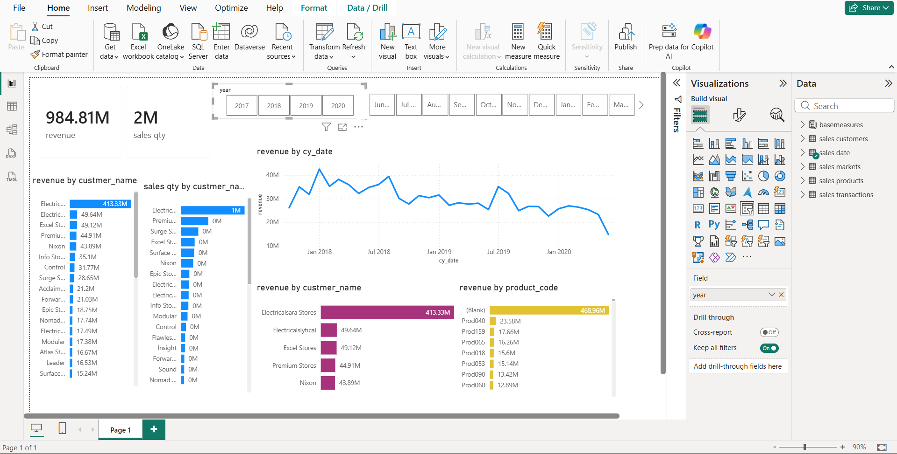

# Sales Insights Data Analysis

## Project Overview
This project analyzes multi-dimensional sales transaction data to evaluate revenue performance, customer contribution, and market trends. The objective was to generate structured business insights that support data-driven decision-making at the management level.

The dataset includes transactions, customers, products, markets, and time dimensions, enabling relational analysis using SQL and dashboard visualization using Power BI.

---

## Business Objectives
- Evaluate total revenue performance across markets and time periods  
- Identify high-performing and underperforming regions  
- Analyze monthly and yearly revenue trends  
- Determine top revenue-contributing customers  
- Assess channel contribution (Brick & Mortar vs E-Commerce)  
- Standardize multi-currency transactions for consistent reporting  

---

## Tools & Technologies
- MySQL  
- SQL (Joins, Aggregations, Group By, Subqueries)  
- Power BI  
- Data Cleaning & Transformation (ETL process)  

---

## Data Preparation
- Imported structured datasets into MySQL  
- Cleaned invalid and inconsistent transaction records  
- Normalized USD transactions into INR for unified revenue analysis  
- Created derived metrics for business reporting  
- Integrated transaction, customer, market, and date tables for relational querying  

---

## Key Performance Indicators (KPIs)
- Total Revenue (Year-wise & Market-wise)  
- Monthly Revenue Trend  
- Revenue by Market  
- Revenue by Customer  
- Sales Quantity Distribution  
- Channel-wise Revenue Contribution  
- Regional Revenue Analysis  

---

## Dashboard Preview

---

## Project Structure

Sales-Insights-Data-Analysis/
- sales-analysis.sql → SQL queries for analytical reporting  
- dashboard.png → Power BI dashboard output  
- clean_transaction_sales.csv → Transaction dataset  
- clean_customers.csv → Customer data  
- clean_products.csv → Product data  
- clean_markets.csv → Market data  
- clean_sales_years.csv → Date dimension data  
- README.md → Project documentation  

---

## Business Impact

The analysis provides a consolidated view of revenue drivers, enabling:

- Identification of top revenue-generating markets  
- Visibility into customer-level contribution  
- Trend monitoring across time periods  
- Improved strategic focus on high-performing segments  

This project demonstrates strong SQL proficiency, structured analytical thinking, and the ability to convert complex data into actionable business insights.
